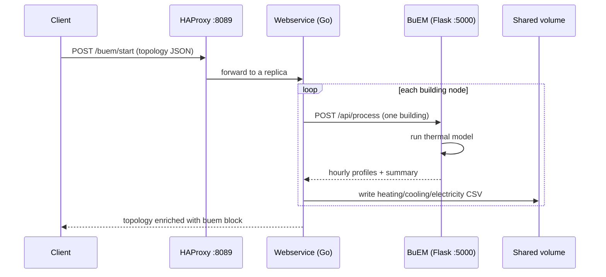

# Architecture

The simulation engine is a set of containers behind one HTTP gateway. This page
covers the parts, how a request flows through them, and the conventions that
every [service guide](../services/index.md) relies on so it does not have to
repeat them.

## Components

| Component | Container name | Role | Published to host |
| --- | --- | --- | --- |
| HAProxy gateway | `enerplanet-sim-haproxy` | Single entry point, load-balances the webservice replicas | `8089` (API), `8405` (stats) |
| Webservice | `enerplanet-webservice-1` … `-N` | Go gateway: receives requests, orchestrates services, writes result files | internal only |
| BuEM | `enerplanet-buem-api` | Flask thermal model (ISO 52016-1 5R1C) | internal only |
| Ignis | `enerplanet-ignis-api` | Heat-demand service (ISO 13790) | internal only |
| Ignis DB | `enerplanet-ignis-db` | PostgreSQL backing Ignis (TABULA archetypes) | internal only |
| PV | `enerplanet-pv` | Photovoltaic yield simulation | `8092` |

!!! warning "Only the gateway is public"
    Every service listens on the internal Docker network only. Send all requests
    to `http://localhost:8089`; the gateway routes them to the right backend. To
    reach a service container directly (e.g. for debugging) use `docker exec`.

## Request flow

A client sends one request describing a **topology** — a set of building nodes.
The webservice fans out to the relevant service per node, collects the results,
writes any time-series files to the shared volume, and returns the enriched
topology.



## Endpoint convention

Every service is mounted under its own path prefix and exposes the same verbs.
In practice you almost always use `/start`.

| Verb | Purpose |
| --- | --- |
| `POST /<service>/start` | Run the simulation and return the result |
| `POST /<service>/configure` | Validate / stage a configuration |
| `POST /<service>/generate` | Build model inputs without running |
| `GET  /<service>/show` | Inspect current state |
| `GET  /<service>/log` | Fetch the service log |
| `POST /<service>/finish` | Clean up a run |

Two gateway-level endpoints are not service-specific:

| Endpoint | Returns |
| --- | --- |
| `GET /health` | `{ "status": "healthy", ... }` |
| `GET /status` | Detailed status of the gateway |

## Storage convention

Result files are written to the Docker volume **`enerplanet_sim_shared_data`**,
which is mounted into every webservice replica at `/webservice/data` and into
BuEM at `/app/results`. Because it is shared, any replica can serve or clean up
another replica's output.

Time-series results are grouped per **model**:

```
/webservice/data/
└── buem/
    └── {model_id}/
        ├── heating_{lat}_{lon}_{year}.csv
        ├── cooling_{lat}_{lon}_{year}.csv
        └── electricity_{lat}_{lon}_{year}.csv
```

!!! tip "Inspecting output"
    The volume is not on the host filesystem directly. List files with:
    ```bash
    docker exec enerplanet-webservice-1 ls -lh /webservice/data/buem/{model_id}/
    ```

## Running the stack

| Command | Effect |
| --- | --- |
| `make build` | Build the `calliope-base` and `webservice` images (first run only) |
| `make up` | Start the full stack (`docker-compose.unltd.yaml`) |
| `make up-min` | Start the minimal / dev stack (`docker-compose.unltd.dev.yaml`) |
| `make down` | Stop the stack |
| `make logs` | Follow all container logs |

!!! note "First-run build"
    The BuEM and Ignis images are built by `make up` on demand (they clone their
    public source repos at build time). The `webservice` and `calliope-base`
    images must be built with `make build` first.
