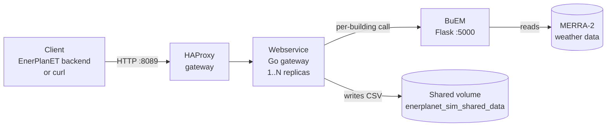

# EnerPlanET Simulation Engine

This manual explains how to **run** the simulation engine and how to **consume**
each simulation service inside it. It is written for operators and integrators,
not only developers: every service has one page that tells you how to start it,
what to send, what you get back, and where the results land.

!!! info "How this manual is organised"
    - **[Architecture](architecture/overview.md)** — the parts of the engine, how a
      request flows through them, and the conventions shared by every service
      (endpoints, storage layout, container names).
    - **[Services](services/index.md)** — one self-contained guide per simulation
      service. Start here if you just want to call a service and read its output.

## Service catalogue

Each service is a separate simulation backend reached through a single HTTP
gateway. The table shows what each one models and whether its manual page is
written yet.

| Service | Models | Reached at | Guide |
| --- | --- | --- | --- |
| **BuEM** | Hourly heating / cooling / electricity per building (ISO 52016-1 5R1C) | `POST /buem/start` | [Ready](services/buem.md) |
| **Ignis** | Annual heat demand per building (ISO 13790, TABULA) | `POST /ignis/start` | Planned |
| **PV** | Photovoltaic yield time series | `POST /pv/start` | Planned |
| **Calliope** | Energy-system optimisation | `POST /calliope/start` | Planned |
| **PyPSA** | Power-system / grid simulation | `POST /pypsa/start` | Planned |

!!! note "Growing gradually"
    This manual is built up one service at a time. BuEM is documented in full and
    is the template every later service page follows. Adding a service means adding
    one page under `docs/services/` and one line to the nav — nothing else changes.

## The 30-second picture



Only the HAProxy gateway is published to the host (port `8089`). Every service
sits behind it on the internal Docker network — you never call a service
container directly.

## Start the engine

From the repository root:

```bash
make build      # build the calliope-base and webservice images (first time only)
make up         # start the whole stack (gateway + all services)
```

Check it is alive:

```bash
curl http://localhost:8089/health
```

```json
{ "status": "healthy", "service": "simulation-engine" }
```

Then open any [service guide](services/index.md) and follow its steps.
