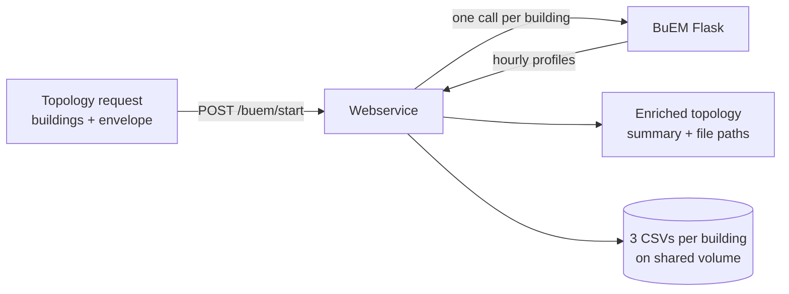

# BuEM — thermal building model

!!! info "Source & attribution"
    BuEM is developed at **Utrecht University** (author: Somadutta Sahoo; CETP
    programme, funded by NWO) and released under the **MIT licence** —
    upstream: [`UU-BUEM/buem`](https://github.com/UU-BUEM/buem),
    docs: <https://buem.readthedocs.io>. We deploy the `main` branch of a fork
    ([`enerplanet/buem`](https://github.com/enerplanet/buem)) that only fixes
    container packaging — the model itself is unchanged.
    See [ATTRIBUTIONS.md](https://github.com/THD-Spatial-AI/simulation-engine/blob/main/ATTRIBUTIONS.md).

## What it does

BuEM is a thermal building-energy model (ISO 52016-1 **5R1C**). Given a
building's geometry, envelope and location, it simulates a full weather year and
returns **hourly heating, cooling and electricity demand** plus summary
statistics. You send a topology of buildings to the gateway; BuEM is run once per
building and each building's node is enriched with its results.



## Prerequisites

| Requirement | Detail |
| --- | --- |
| Stack running | `make build` then `make up` (see [Architecture](../architecture/overview.md#running-the-stack)) |
| Weather data | MERRA-2 NetCDF files mounted into the BuEM container |
| Request fixture | `testdata/test_buem_topology_request.json` (shipped in this repo) |

### Weather data

BuEM reads MERRA-2 NetCDF files named `combined_merra_{year}.nc`. The files are
mounted read-only into the container at `/buem/data/weather`, organised by
country sub-directory. BuEM auto-selects the country from each building's
coordinates.

```
/buem/data/weather/
├── germany/       combined_merra_2015.nc … combined_merra_2025.nc
├── austria/
├── czech/
└── netherlands/
```

The host path is set by `BUEM_WEATHER_DIR_HOST` (defaults to
`./data/buem-weather` relative to the compose file). Point it at your MERRA-2
archive, for example the copy under `BuEM/buem/data/merra`.

!!! warning "Empty weather directory = failed runs"
    The health check passes without weather data, but a simulation will fail if
    no `.nc` file matches the building's country. Confirm the files are visible
    **inside** the container:
    ```bash
    docker exec enerplanet-buem-api ls /buem/data/weather/germany
    ```

## Start & health-check

Bring the stack up, then confirm both the gateway and BuEM are ready.

```bash
# Gateway (published on the host)
curl http://localhost:8089/health
# → { "status": "healthy", "service": "simulation-engine" }
```

BuEM itself is **not** published to the host. Check it through the container:

```bash
docker exec enerplanet-buem-api curl -fsS http://localhost:5000/api/health
# → { "status": "ok" }
```

!!! note "Port 5010 does not exist here"
    Earlier BuEM setups published the Flask API on host port `5010`. In this
    engine BuEM listens on `5000` on the internal network only. Always reach it
    through the gateway on `8089`, or with `docker exec` for debugging.

## Input specification

`POST /buem/start` accepts a topology request. The top level describes the run;
each building lives in a topology node under `properties.buem`.

| Field | Type | Description |
| --- | --- | --- |
| `model_id` | string | Isolates output — CSVs are written under this name |
| `start_date` | RFC 3339 | Simulation window start; its **year** selects the weather file |
| `end_date` | RFC 3339 | Simulation window end |
| `resolution` | integer | Output resolution in minutes (e.g. `60`) |
| `topology` | array | List of `{ from, to }` node pairs |

Each node (`from` / `to`) is a GeoJSON feature; its `properties.buem.building`
describes the building:

| `building` field | Example | Description |
| --- | --- | --- |
| `country` | `"DE"` | ISO 3166-1 alpha-2 code |
| `construction_period` | `"1980-2000"` | TABULA construction band |
| `building_type` | `"MFH"` | Archetype (e.g. SFH, MFH) |
| `A_ref` | `{ "value": 363.4, "unit": "m2" }` | Reference floor area |
| `h_room` | `{ "value": 2.7, "unit": "m" }` | Room height |
| `envelope.elements` | array | Wall / roof / window elements with areas and U-values |

An optional `solver` block tunes the run (e.g. `{ "use_milp": false }`).

!!! info "Full example"
    The complete request is in `testdata/test_buem_topology_request.json` — two
    buildings, model `demo-model-001`. Use it as the reference payload.

## Consume it

Run the shipped fixture through the gateway and read the heating totals:

```bash
curl -s -X POST http://localhost:8089/buem/start \
  -H "Content-Type: application/json" \
  -d @testdata/test_buem_topology_request.json | jq '{
    model_id: .model_id,
    building_1_heating_kWh: .topology[0].from.properties.buem.thermal_load_profile.summary.heating.total,
    building_2_heating_kWh: .topology[0].to.properties.buem.thermal_load_profile.summary.heating.total
  }'
```

Expected result (values vary slightly with the MERRA-2 year):

```json
{
  "model_id": "demo-model-001",
  "building_1_heating_kWh": { "unit": "kWh", "value": 85545.517 },
  "building_2_heating_kWh": { "unit": "kWh", "value": 85545.539 }
}
```

## Output specification

### Response body

Each building node is enriched with `properties.buem.thermal_load_profile`:

| Field | Description |
| --- | --- |
| `summary.heating` | `total` (kWh) plus `min`/`max`/`mean`/`median`/`std` (kW) |
| `summary.cooling` | Same statistics for cooling |
| `summary.electricity` | Same statistics for electricity |
| `summary.peak_heating_load` | Peak heating power (kW) |
| `summary.peak_cooling_load` | Peak cooling power (kW) |
| `summary.energy_intensity` | Total demand per floor area (kWh/m²) |
| `summary.total_energy_demand` | Heating + cooling + electricity (kWh) |
| `heating_file` / `cooling_file` / `electricity_file` | Path to each CSV on the shared volume |
| `resolution` | Output resolution echoed back |

Example `summary` (building 1):

```json
{
  "heating":     { "total": { "unit": "kWh", "value": 85545.517 } },
  "cooling":     { "total": { "unit": "kWh", "value": 2523.378 } },
  "electricity": { "total": { "unit": "kWh", "value": 3783.738 } },
  "peak_heating_load":  { "unit": "kW",     "value": 34.94 },
  "energy_intensity":   { "unit": "kWh/m2", "value": 252.759 },
  "total_energy_demand":{ "unit": "kWh",    "value": 91852.633 }
}
```

### CSV files

Three CSV files are written per building — one each for heating, cooling and
electricity. Each is a single `demand` column of **8760 hourly values in kW**
(one full weather year), header included:

```csv
demand
19.00950133202262
19.162132866903892
...
```

## Where output is stored

Files land on the shared volume `enerplanet_sim_shared_data`, under the
`model_id`, named by coordinate and weather year:

```
/webservice/data/buem/
└── demo-model-001/
    ├── heating_48.833911_12.957720_2018.csv
    ├── cooling_48.833911_12.957720_2018.csv
    ├── electricity_48.833911_12.957720_2018.csv
    ├── heating_48.833847_12.958071_2018.csv
    ├── cooling_48.833847_12.958071_2018.csv
    └── electricity_48.833847_12.958071_2018.csv
```

List and remove them through any webservice replica:

```bash
# List (6 files for a 2-building model)
docker exec enerplanet-webservice-1 ls -lh /webservice/data/buem/demo-model-001/

# Remove one model's output
docker exec enerplanet-webservice-1 rm -rf /webservice/data/buem/demo-model-001/
```

!!! note "Profiles persist"
    Output is never deleted automatically — it lives for the lifetime of the
    model. Only the intermediate `.gz` time-series files are removed after the
    CSVs are extracted.

## Endpoints

All BuEM routes are served by the gateway under `/buem`.

| Method | Path | Purpose |
| --- | --- | --- |
| POST | `/buem/start` | Run the model and return the enriched topology |
| POST | `/buem/configure` | Validate / stage a configuration |
| POST | `/buem/generate` | Build model inputs without running |
| GET | `/buem/show` | Inspect current state |
| GET | `/buem/log` | Fetch the BuEM log |
| POST | `/buem/finish` | Clean up a run |

Internal BuEM Flask routes (reached only by the webservice, not clients):

| Method | Path | Purpose |
| --- | --- | --- |
| GET | `/api/health` | Health check |
| POST | `/api/process` | Run one building |

## Troubleshooting

| Symptom | Likely cause | Fix |
| --- | --- | --- |
| `curl localhost:5010` refused | BuEM is not published on the host | Use `8089` gateway, or `docker exec enerplanet-buem-api` |
| Run fails, no CSVs written | Weather directory empty for the building's country | Populate `BUEM_WEATHER_DIR_HOST`; verify inside container |
| Heating total off by a few % | Different MERRA-2 weather year selected | Expected — the `start_date` year picks the file |
| `demo-model-001` folder missing | Run did not complete | Check `docker exec enerplanet-buem-api curl localhost:5000/api/health` and `make logs` |

## Reproducibility check

The two-building fixture is the reference for a working install. A correct run
produces, per building, a heating total of roughly **85,500 kWh**, an energy
intensity near **253 kWh/m²**, and six CSV files under the model folder.
